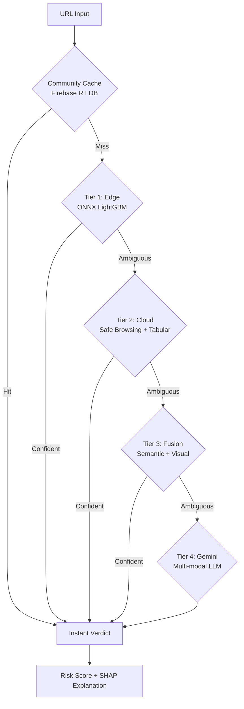

# 🛡️ PhishGuard

[](https://www.python.org/downloads/release/python-3110/)
[](https://opensource.org/licenses/MIT)

**PhishGuard** is an ultra-reliable, multi-modal phishing detection system featuring a **4-tier cascade architecture**. It provides real-time protection by orchestrating Edge, Cloud, and LLM (Gemini) intelligence to achieve >99.5% F1-score with minimal latency.


---

## ✨ Key Features

- **Blazing Fast Edge Inference**: Sub-15ms URL analysis directly in the browser using ONNX and WASM.
- **Multimodal Analysis**: Combines URL lexical features, raw HTML structure (CodeBERT), and visual branding (EfficientNet) for deep inspection.
- **LLM-Powered Arbiter**: Leverages Google Gemini 1.5 Flash for the most sophisticated and highly ambiguous threats.
- **Explainable AI**: Provides transparency into model decisions through SHAP values and Grad-CAM heatmaps.
- **Privacy-First**: Edge computing ensures your data stays local unless a deep scan is explicitly required.

---

## 🧠 Architecture: The 4-Tier Cascade

PhishGuard uses a hierarchical approach to balance speed and accuracy. Only the most ambiguous cases reach the heavy LLM layer.




### The Tiers
1. **Tier 1 (Edge):** Sub-15ms URL lexical analysis using **LightGBM** quantized to **ONNX (INT8)**. Runs locally in the browser via the extension.
2. **Tier 2 (Cloud):** Google Safe Browsing API check + high-precision Tabular analysis (XGBoost/LightGBM) on the backend.
3. **Tier 3 (Multimodal Fusion):** Deep semantic analysis (**PhishBERT** for URLs, **CodeBERT** for HTML) and visual branding analysis (**EfficientNet-B7**). Outputs are fused via an **Attention-Fusion** layer.
4. **Tier 4 (LLM/Gemini):** **Gemini 1.5 Flash** acts as the final arbiter for highly sophisticated phish, analyzing raw HTML and page screenshots.

---

## 🛠️ Tech Stack

### Frontend & Edge
- **Chrome Extension:** Manifest V3, Service Workers
- **Inference Engine:** ONNX Runtime Web (WASM-accelerated)
- **Communication:** Async Fetch API with timeout fallbacks

### Backend & AI
- **Framework:** FastAPI (Python 3.11) + Uvicorn
- **Deep Learning:** PyTorch, Transformers (HuggingFace), EfficientNet
- **Classic ML:** Scikit-learn, XGBoost, LightGBM, Optuna
- **Explainability:** SHAP (TreeExplainer), Grad-CAM (Visual Heatmaps)
- **Data Augmentation:** CTGAN (Synthetic Data Generation), VAE (HTML Latent Features)

### Infrastructure
- **Database:** Firebase Realtime DB (Community Threat Intel)
- **LLM:** Google Gemini 1.5 Flash API
- **Deployment:** Docker + Google Cloud Run
- **Monitoring:** Weights & Biases (W&B)

---

## 📂 Project Structure

```text
PhishGuard/
 ├── backend/             # FastAPI Cloud server and orchestration
 ├── extension/           # Chrome Extension (MV3, ONNX, WASM)
 ├── src/
 │   ├── data/            # Dataset synthesis and GAN augmentation
 │   ├── features/        # Dual-stream feature extraction (URL + HTML)
 │   ├── models/          # Implementation of PhishBERT, CodeBERT, EfficientNet, Fusion
 │   ├── explainability/  # SHAP pipelines and human-readable reasoning
 │   └── evaluation/      # Adversarial benchmarks and ablation studies
 ├── models/              # [Artifacts] Trained .onnx, .pth, and .pkl models
 ├── datasets/            # [Data] Unified phishing corpus (394k+ samples)
 ├── papers/              # Research foundation and literature
 └── requirements.txt     # Python dependency manifest
```

---

## 🚀 Getting Started

### Prerequisites
- Python 3.11+
- Google Chrome browser

### 1. Backend Setup
1. Clone the repository and create a virtual environment:
   ```bash
   git clone https://github.com/your-username/PhishGuard.git
   cd PhishGuard
   python -m venv venv
   source venv/bin/activate  # Or `venv\Scripts\activate` on Windows
   ```
2. Install dependencies:
   ```bash
   pip install -r requirements.txt
   ```
3. Configure Environment Variables:
   Create a `.env` file in the root directory with the following keys:
   ```env
   GEMINI_API_KEY=your_gemini_api_key
   SAFE_BROWSING_API_KEY=your_safe_browsing_key
   FIREBASE_CREDENTIALS=path/to/firebase/creds.json
   ```
4. Run the development server:
   ```bash
   uvicorn backend.main:app --reload
   ```

### 2. Extension Installation
1. Open Chrome and navigate to `chrome://extensions`.
2. Enable **Developer mode** in the top right corner.
3. Click **Load unpacked** and select the `extension/` folder from this repository.
4. Pin the extension for easy access and configure any settings if required.

---

## 🤝 Contributing
Contributions are welcome! Please feel free to submit a Pull Request or open an Issue for any bugs, feature requests, or improvements.

## 📄 License
This project is licensed under the MIT License - see the [LICENSE](LICENSE) file for details.